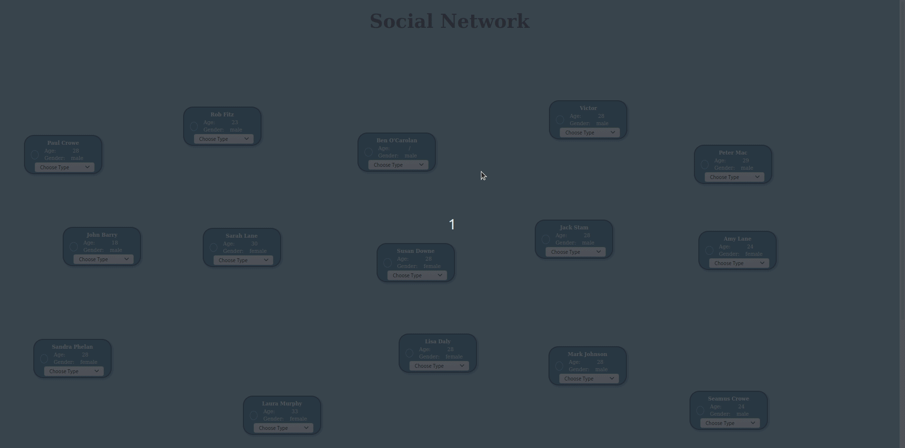

# social-network
The goal of this test was to create a Web app for examining a Social Network. Web app provides functionality to choose a person within the group stored in the dataset provided and display the following information about this person:

* Direct friends: those people who are directly connected to the chosen user; 
* Friends of friends: those who are two steps away from the chosen user but not directly connected to the chosen user; 
* Suggested friends: people in the group who know 2 or more direct friends of the chosen user but are not directly connected to the chosen user;

*There were some inconsistencies in given dataset (user with id 18 has only one friend (id 17) but two other user has this user as friend (id 17 and 20)) so some results may not come out as expected.
___
## Prerequisites
Live server is required to run this project.
___
## Installing
Just clone repository and run it with live server.
___
## Folder sturcture
<pre><b>.</b>
├── <b>assets</b>
│   ├── data.json // Provided dataset
│   └── <b>style</b>
│       └── style.css
├── index.html
├── <b>preview.gif</b>
├── README.md
└── <b>src</b>
    ├── <b>components</b>
    │   └── user.js
    ├── index.js
    ├── <b>layout</b>
    │   ├── content.js
    │   ├── footer.js
    │   └── header.js
    └── <b>utilities</b>
        ├── services.js // function for retrieving all users 
        └── utilities.js // functions for retrieving direct friends, friends of friends and suggested friends.
</pre>
___
## Preview 

___
## Known Issues 
App will crash during resizing of window (Lines drawn from chosen user to friends won't redraw but users will change their position).
___
